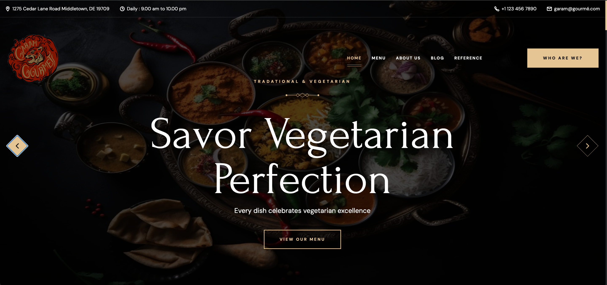
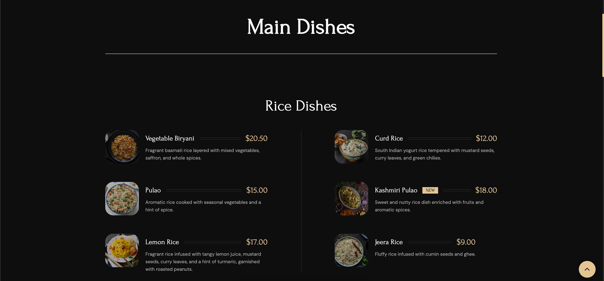
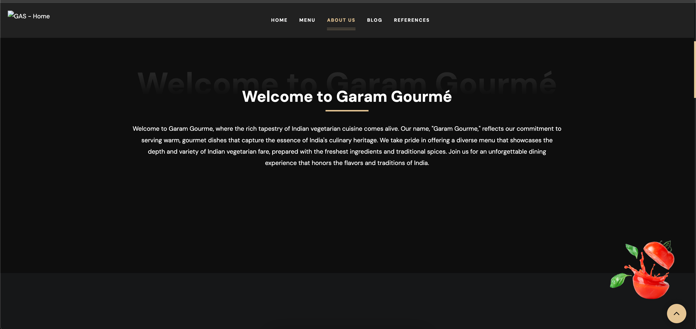
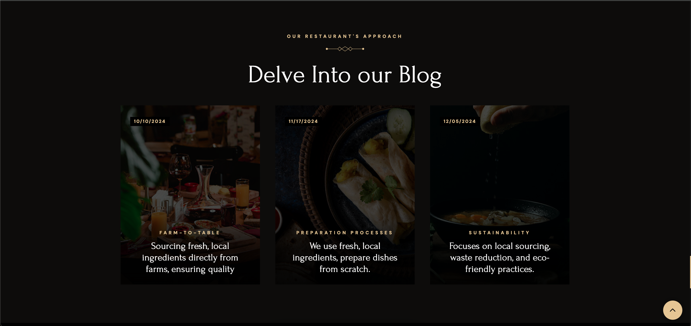
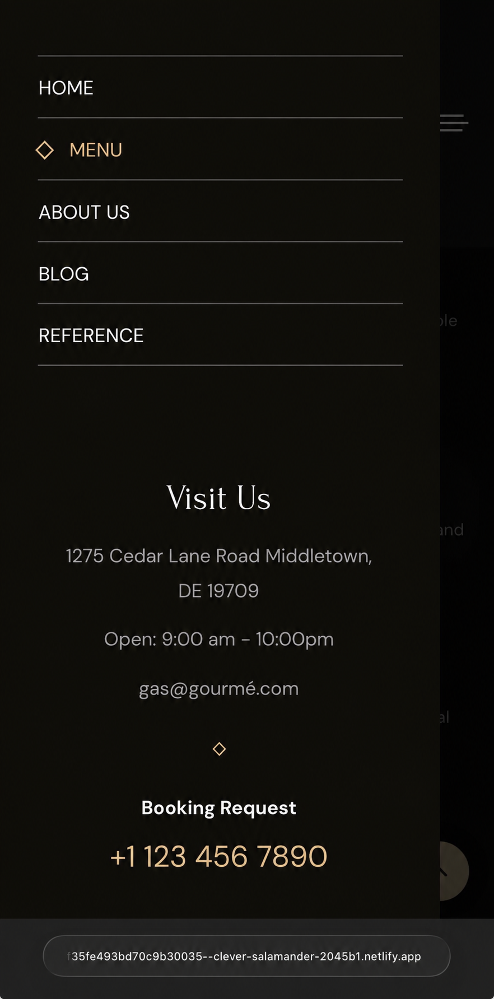
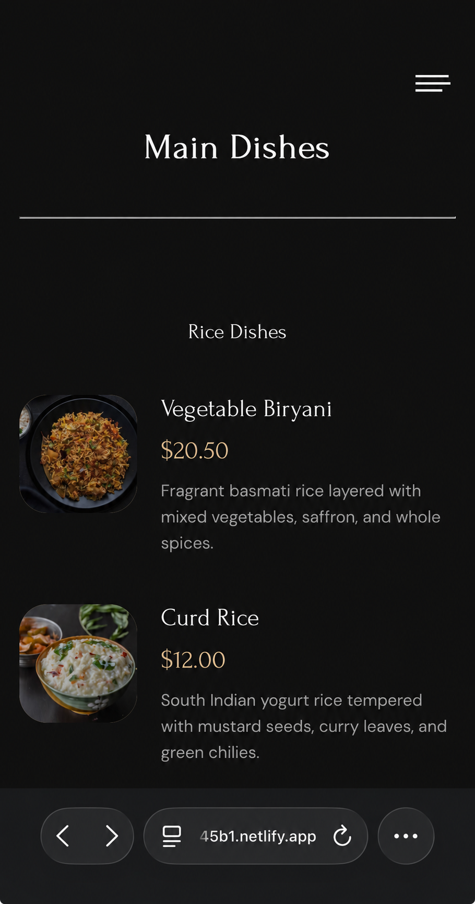

# # Vegetarian Restaurant Website | Front-End Development Project 

## Overview

A responsive multi-page restaurant website designed and developed for a plant-based restaurant concept. This project focuses on creating a modern, accessible, and user-friendly digital experience through front-end development, responsive layouts, and custom visual design.

The website includes multiple sections including a homepage, restaurant information pages, menu system, and blog content. The project demonstrates the process of designing, developing, and deploying a complete website from concept to a publicly accessible product.

## Live Demo

**Website:**  
https://67a7f35fe493bd70c9b30035--clever-salamander-2045b1.netlify.app/

## Features

- Responsive website design for different screen sizes
- Multi-page navigation and structured content organization
- Custom restaurant menu interface
- About and informational sections
- Blog section for restaurant-related content
- Custom CSS styling and visual components
- Interactive elements powered by JavaScript
- Organized asset management for images and design resources
- Public deployment through Netlify

## Technologies Used

- HTML5
- CSS3
- JavaScript
- Netlify Deployment

## Technical Skills Demonstrated

- Front-end web development
- Responsive design
- UI/UX implementation
- File organization and project structure
- Website deployment and hosting
- Client-focused design thinking

## Project Structure
├── index.html
├── about.html
├── menu.html
├── blog.html
├── assets/
│ ├── css/
│ └── images/
├── images/
├── js/
│ └── script.js
├── screenshots/
│ ├── homepage.png
│ ├── about.png
│ ├── menu.png
│ ├── blog.png
│ ├── mobile-nav.png
│ └── mobile-menu.png
└── favicon.svg
 
## Development Process

This project involved designing the user interface, structuring multiple web pages, implementing responsive styling, organizing website assets, and deploying the finished product online.

Throughout development, I focused on creating a balance between visual design and technical implementation while considering usability, accessibility, and the overall user experience.

## Engineering Reflection

Building this website strengthened my understanding of front-end development and the process of turning an idea into a functional digital product.

Key areas explored included:

- Creating structured and maintainable HTML layouts
- Developing reusable CSS styling systems
- Organizing project files and digital assets
- Improving user experience through thoughtful design choices
- Deploying and maintaining a live website

## Future Improvements

Potential future improvements include:

- Adding a restaurant reservation system
- Expanding interactive features
- Improving accessibility features
- Optimizing website performance
- Adding analytics to better understand user engagement
- Connecting the website to additional web services

## Developer

**Srinidhi Kotteswaran**

Interested in computer science, artificial intelligence, and building technology-driven solutions.

GitHub:
https://github.com/SrinidhiKotteswaran

## Screenshots

### Homepage

### Menu Page

### About Page

### Blog Page

### Mobile Responsive Design

