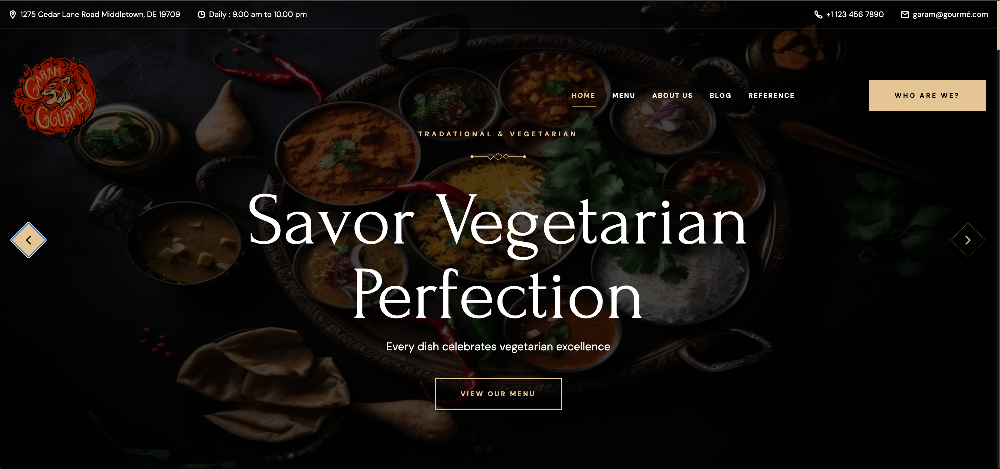
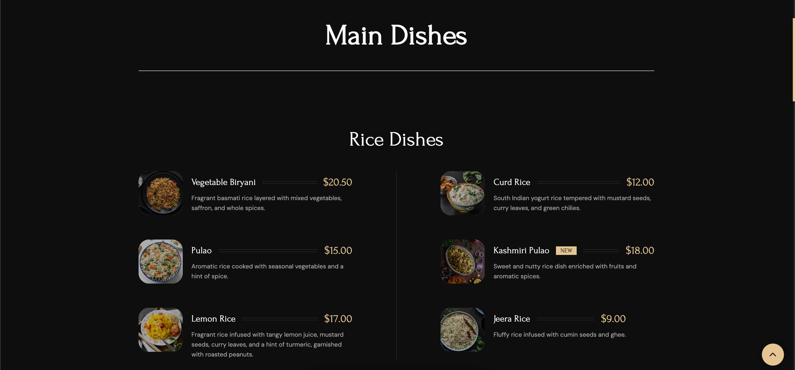
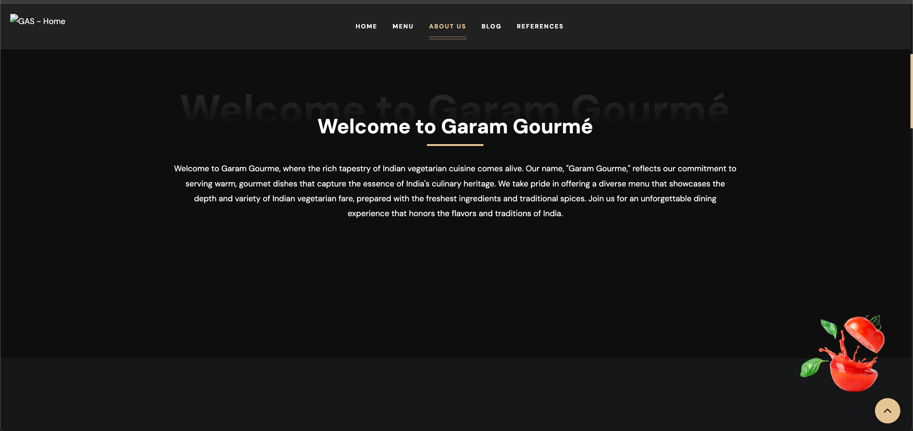
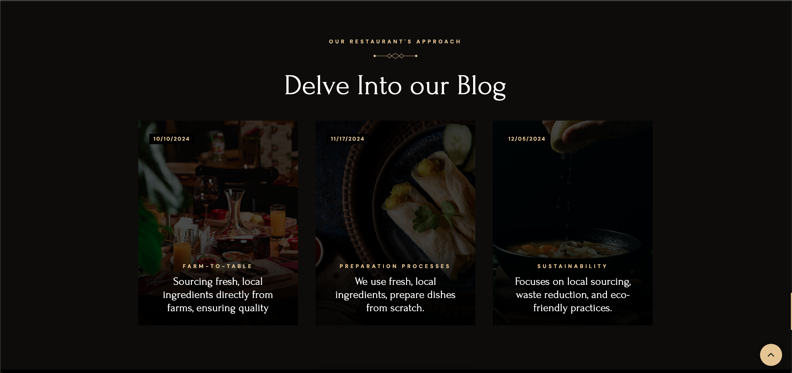
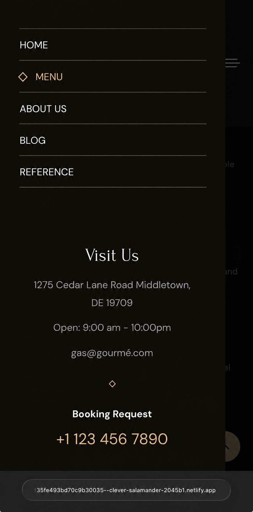
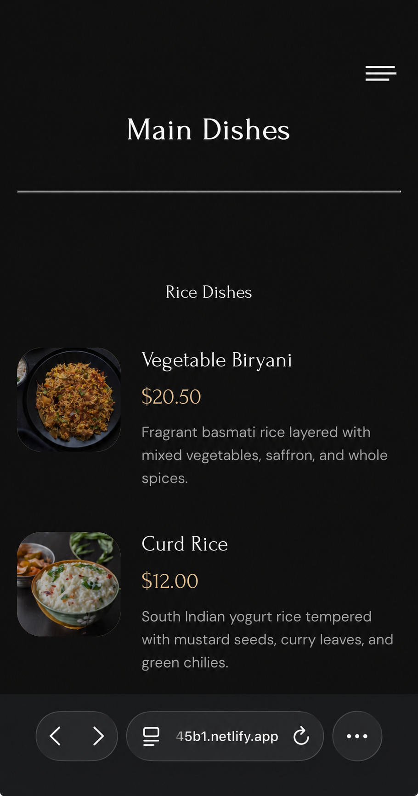

# Vegetarian Restaurant Website

A responsive multi-page restaurant website designed and developed for a plant-based restaurant concept. I built the interface from the ground up with a focus on visual design, responsive behavior, usability, and turning a static concept into a complete deployed website.

## Live Demo

**[View the live website](https://67a7f35fe493bd70c9b30035--clever-salamander-2045b1.netlify.app/)**

## Project Overview

The site is organized as a complete restaurant experience rather than a single landing page, with a homepage, menu, about section, blog content, and responsive mobile navigation.

The project gave me a chance to work through the full front-end workflow: structuring pages, designing reusable visual patterns, handling responsive layouts, organizing assets, adding interaction, and deploying the finished product.

## Features

- Responsive layouts across desktop and mobile screens
- Multi-page navigation and structured content hierarchy
- Custom restaurant menu interface
- About and informational sections
- Restaurant-focused blog section
- Custom CSS styling and visual components
- Interactive JavaScript elements
- Organized image and asset management
- Public deployment through Netlify

## Technologies

- **HTML5** — semantic page structure
- **CSS3** — responsive layouts, visual styling, and components
- **JavaScript** — interactive behavior
- **Netlify** — deployment and hosting

## Screenshots

The screenshots below show the main user-facing experience across desktop and mobile layouts.

### Desktop Experience

#### Homepage

The primary landing experience establishes the restaurant's visual identity and guides visitors into the rest of the site.

  

#### Menu & About

<table>
  <tr>
    <td width="50%" align="center">
      <strong>Menu</strong>  
      
    </td>
    <td width="50%" align="center">
      <strong>About</strong>  
      
    </td>
  </tr>
</table>

#### Blog

The blog page extends the site beyond the core restaurant information into a content-focused experience.

  

### Responsive Design

The interface was designed to adapt to smaller screens, including a mobile navigation experience and a responsive menu layout.

<table>
  <tr>
    <td width="50%" align="center">
      <strong>Mobile Navigation</strong>  
      
    </td>
    <td width="50%" align="center">
      <strong>Mobile Menu</strong>  
      
    </td>
  </tr>
</table>

## Technical Skills Demonstrated

### Front-End Development

- Semantic HTML structure
- CSS layout and responsive design
- JavaScript-driven interactions
- Multi-page site architecture
- Reusable visual patterns

### UI / UX

- Visual hierarchy and information architecture
- Responsive navigation
- Desktop-to-mobile adaptation
- Readable content organization
- Designing around the user's path through the site

### Deployment

- Production deployment through Netlify
- Organizing assets for a deployable project
- Maintaining a publicly accessible front-end application

## Development Process

I approached the project as a complete product rather than a collection of individual pages. I first established the restaurant's visual direction and page structure, then implemented the core layouts and navigation before refining responsive behavior and interactive elements.

A major part of the process was making the same content work across substantially different screen sizes. The mobile screenshots show the resulting navigation and menu adaptations rather than simply presenting a scaled-down desktop page.

## Engineering Reflection

This project strengthened my understanding of the gap between making a page *look good* and building a usable front-end product.

I learned to think about:

- How page structure affects navigation and usability
- How CSS decisions propagate across multiple screen sizes
- How to organize assets and pages so a project remains maintainable
- How visual design and technical implementation influence each other
- What changes are necessary when moving from a desktop-first view to mobile
- How to take a project from local development to a public deployment

## Future Improvements

If I continued developing the project, I would add:

- A functional restaurant reservation flow
- More interactive menu features
- Expanded accessibility testing and improvements
- Additional performance optimization
- Analytics for understanding user behavior
- Integration with external web services

## Developer

**Srinidhi Kotteswaran**

Interested in computer science, artificial intelligence, and building technology-driven solutions.

[GitHub](https://github.com/SrinidhiKotteswaran)
